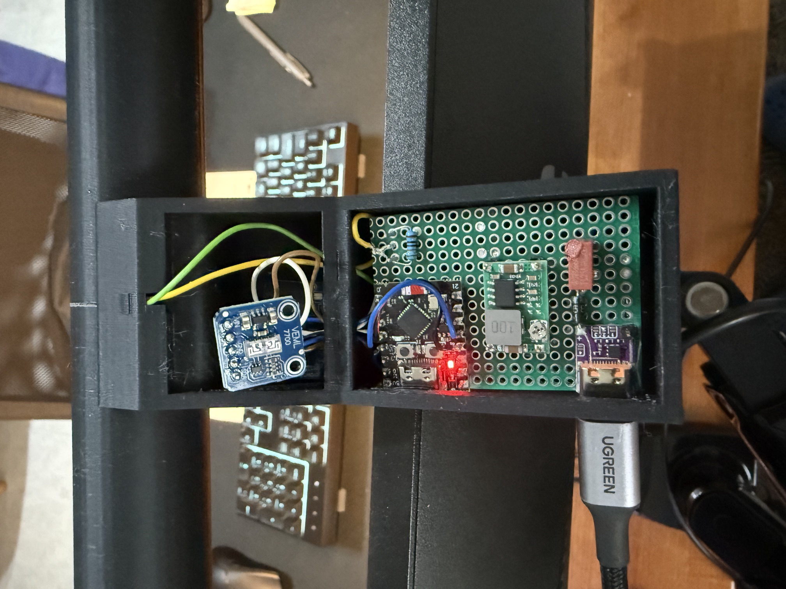
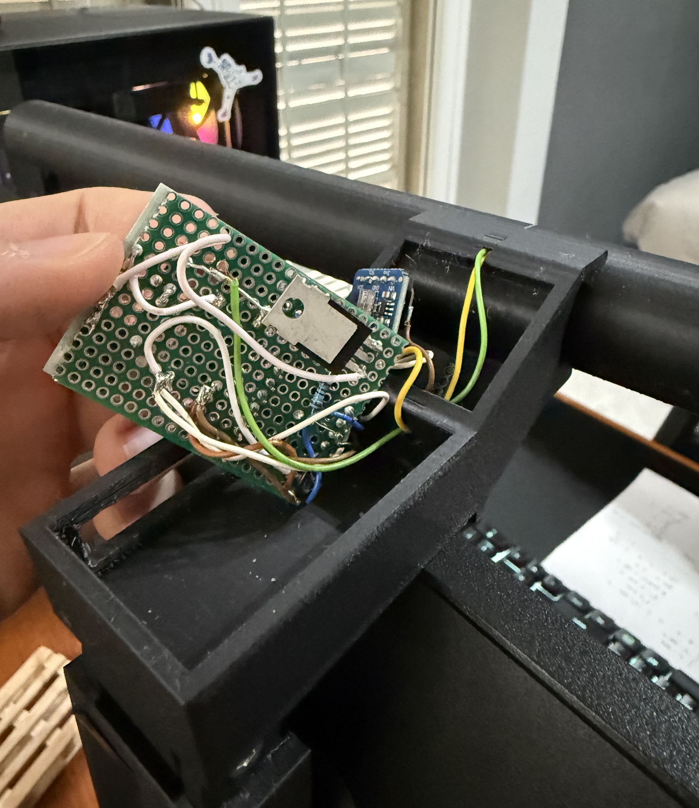

# Smart Monitor Light Bar (ESP32-C3)

## Overview
I wanted a smart monitor bar without spending hundreds of euros for something like the BenQ monitor lamp, so I tried to DIY it. Everithing runs on an ESP32-C3 microcontroller, a bit overkill but it will be useful for future upgrade. To control the led, the ESP32 rely on two sensors: a VELM7700 luminosity sensor to dynamically adjusts the leds brightness to maintain optimal lighting conditions, and a LD2410 presense sensor to automatically activates when a user sits.

## 3D Design
*(Insert your 3D design description here. You can describe the assembly process, the housing for the electronics, and how the clip or gravity mount is designed to fit your monitor.)*

## Electronics
The system is powered by a 12V input managed via a USB-C Power Delivery (PD) controller, which negotiate with the power supply to ensures 12V for the leds strips. A Mini360 step-down converter reduces this voltage to 5V to power the ESP32-C3 and the sensors, while a dedicated 1.25A fuse protects the entire circuit. The light engine consists of a 12V LED strip driven by an IRLZ44N MOSFET, which allows for precise PWM dimming controlled by the ESP32.

The "intelligence" of the hardware relies on two main modules: an LD2410 presence sensor connected via UART and a VEML7700 ambient light sensor communicating through the I2C protocol. The current prototype, as shown in the images below was built on a protoboard to validate the schematic (see Prototype_board_schematic.pdf) before moving to the custom PCB currently being tested.

> **Prototype Gallery**
> 
> **
>
> 
> **

I also included the Kicad project of the custom pcb board I implemented. Yeah, it is overkill but why no? I wanted to learn to use Kicad and develop my first PCB. Currently I'm waiting for it to arrive and test it. 

## Code
The firmware is developed within the Arduino framework and utilizes a non-blocking logic to monitor environmental changes in real-time. The core functionality revolves around an adaptive dimming algorithm: the system reads the ambient lux levels via the VEML7700 and applies a square root function to calculate the ideal LED duty cycle. This function actually work like the luminosity on the phone, so it increase if the lux of the room are high, while decrease if there is not light in the room. Maybe it is counterintuitive but it works for me. Change it as you want. 
To prevent annoying flickering or constant micro-adjustments, the code implements a hysteresis logic, only triggering a brightness transition if the change in light is significant. Furthermore, the integration with the LD2410 mmWave radar allows the lamp to manage power efficiently, executing smooth fade-in and fade-out transitions whenever a user enters or leaves the desk area, ensuring the light is only active when actually needed.
